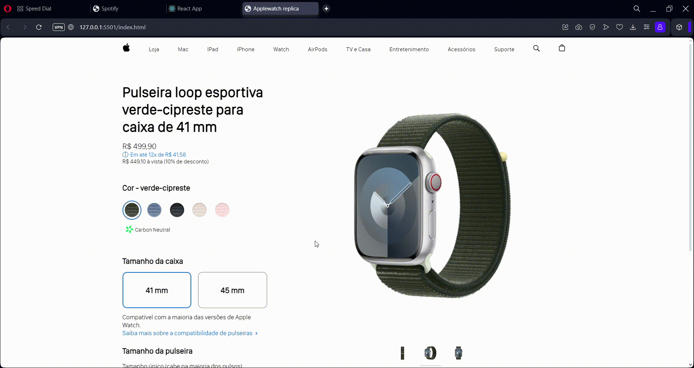

# Réplica página de vitrine do Apple Watch

Neste projeto, foram utilizados mockups idênticos aos da página original para replicar perfeitamente o ambiente virtual de compras do smartwatch da Apple. Foram utilizadas as tecnologias web HTML, CSS e Javascript.
Abaixo encontra-se um GIF que mostra algumas das funcionalidades do projeto.

